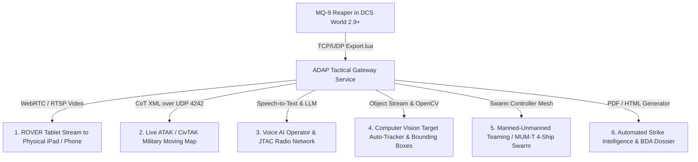

# Next-Level Innovations (Pushing DCS World to the Limit)
## Advanced Autonomous Drone Architecture, External Data Bridges & AI Systems

---

## 1. Executive Vision: Beyond the Cockpit Glass

Modern flight simulations often trap the player inside the rendering window. But real-world unmanned combat operations are **distributed, networked, and multi-domain**. A Reaper flight crew in Nevada does not operate in isolation; their sensor feed is beamed across satellites, consumed on ruggedized tablets by infantry in foxholes, cross-referenced with satellite reconnaissance, and coordinated via digital tactical networks.

This document explores **bleeding-edge innovations that are technically possible within the architectural limitations of modern DCS World (2.9+)**, leveraging DCS Lua socket APIs, C++ export interfaces, external web networks, computer vision, and artificial intelligence to create a truly transcendent drone combat ecosystem.



---

## 2. Innovation 1: Real-World ROVER Video Downlink (Live iPad / Tablet Stream)

### The Real-World Concept:
In combat, Joint Terminal Attack Controllers (JTACs) and forward infantry carry **ROVER 5 (Remotely Operated Video Enhanced Receiver)** ruggedized tablets. They see the exact real-time video feed transmitted from the orbiting MQ-9's sensor turret, pinch-to-zoom over target compounds, and mark enemy positions.

### Feasibility in DCS World:
* **DCS Limitation**: DCS does not have a native web browser output for cockpit displays.
* **The Next-Level Solution**:
  * Build a lightweight external helper service in Go / Python that hooks into DCS World's exported sensor viewport buffer or uses high-speed DirectX/DXGI desktop capture (`DXGI Desktop Duplication API` at 60 FPS).
  * Streams the live Raytheon MTS-B camera feed over local Wi-Fi via **WebRTC / WebSockets** with sub-50ms latency.
  * Any real-world device—an iPad, Android tablet, smartphone, or second monitor—can open `http://<DCS_PC_IP>:8080/rover` in Safari or Chrome.
* **Tactical Experience**:
  * Your friend sitting in the same room (or across Discord) holds a physical iPad, watching your live Reaper FLIR feed over the battlefield, calling out enemy tanks, and advising your strike in real time!

---

## 3. Innovation 2: Live ATAK / CivTAK Cursor-on-Target (CoT) Network Bridge

### The Real-World Concept:
The US Department of Defense, NATO allies, and first responders utilize **ATAK (Android Tactical Assault Kit)**—a geospatial tactical map application running on military smartphones mounted to body armor. Units share positions, drone flight vectors, and target spots using the **Cursor-on-Target (CoT)** XML protocol.

### Feasibility in DCS World:
* **DCS Capability**: DCS provides `Export.lua` with raw Lua socket UDP capabilities (`socket.udp()`), which runs asynchronously without degrading sim performance.
* **The Next-Level Solution**:
  * Develop a DCS-to-ATAK bridge script.
  * Every 1.0 second, the script queries the MQ-9 Reaper's coordinates, heading, altitude, and current laser target spot (`reaperState.targetCoord`).
  * Encapsulates this telemetry into authentic CoT XML packets:
    ```xml
    <event version="2.0" uid="MQ9-REAPER-11" type="a-f-A-M-F-Q" time="..." stale="...">
        <point lat="42.238" lon="42.307" hae="2500" ce="1.0" le="1.0"/>
        <detail>
            <track speed="65.0" course="090.0"/>
            <contact callsign="REAPER 1-1"/>
            <sensor fov="4.8" az="012.0" el="-34.0" range="4200"/>
        </detail>
    </event>
    ```
  * Broadcasts packets over UDP port `4242` to your home network.
* **Tactical Experience**:
  * You or your ground squad run free **CivTAK** on an Android tablet or laptop.
  * The MQ-9 Reaper appears on the real satellite map with an active sensor footprint cone, and whenever you right-click or mark a target in DCS, a red hostile icon instantly pops up on the tablet!

---

## 4. Innovation 3: Voice-Controlled AI GCS Operator & Autonomous JTAC

### The Real-World Concept:
Reaper crews and CAS pilots communicate via voice radios (VHF/UHF), issuing clear 9-line briefs and directional tasking commands.

### Feasibility in DCS World:
* **DCS Capability**: DCS Mission Scripting Environment (`Controller:setTask()`) allows full programmatic command of aircraft heading, altitude, orbit, and weapons release.
* **The Next-Level Solution**:
  * Integrate **Local Whisper Voice Recognition (or Vosk)** + a fine-tuned lightweight local LLM (or regex semantic parser) connected to **DCS-SRS (Simple Radio Standalone)** or microphone input.
  * **Voice Tasking Workflow**:
    1. Player speaks over radio: *"Reaper 1-1, push to Waypoint 3, establish left orbit at 12,000 feet, and lase target on code 1688."*
    2. Voice AI transcribes and parses the military phonetics.
    3. Python/Lua bridge immediately commands DCS controller tasks:
       ```lua
       applyOrbitTask(false) -- Left orbit
       reaperState.assignedAlt = 3657 -- 12,000 ft
       reaperState.laserCode = 1688
       reaperState.laserActive = true
       ```
    4. Text-to-Speech engine (using authentic military radio filter with sidetone) responds over the player's headset:
       *"Reaper 1-1 copies, pushing Waypoint 3, left hand orbit angels 12, laser active on 1688."*

---

## 5. Innovation 4: Computer Vision Target Auto-Tracker (AI Sensor Operator)

### The Real-World Concept:
Modern electro-optical turrets like the Raytheon MTS-B and L3Harris WESCAM MX-20 features automated target detection, video motion tracking, and optical feature locking.

### Feasibility in DCS World:
* **The Next-Level Solution**:
  * Utilize DCS World's world search API (`world.searchObjects`) or an external OpenCV / YOLOv8 neural network reading the sensor stream.
  * In the custom screenspace HUD (`GCS_HUD`), dynamically render **AI Target Bounding Boxes**:
    * Green diamond or bracket snaps over detected enemy vehicles within the camera FOV:
      ```
             [ + ] T-72B MAIN BATTLE TANK
             CONFIDENCE: 96% | RANGE: 4,280M
      ```
    * **Predictive Lead Reticle**: Calculates target speed and bearing, rendering a lead aiming cross for precision Hellfire employment against moving convoys.
    * **Auto-Slew Track**: Drone gimbal automatically servos to follow a moving enemy convoy without requiring manual mouse adjustment.

---

## 6. Innovation 5: Manned-Unmanned Teaming (MUM-T) Autonomous Swarm Mesh

### The Real-World Concept:
Under modern U.S. Army and Air Force **MUM-T (Manned-Unmanned Teaming)** doctrine, an AH-64E Apache Guardian or F-35 pilot commands a flight of autonomous loyal wingman drones directly from cockpit multifunction displays.

### Feasibility in DCS World:
* **The Next-Level Solution**:
  * Create an integrated multi-drone flight director capable of managing a **4-Ship Reaper Strike Swarm**:
    * **Drone 1 (High Overwatch)**: Orbiting at 35,000 ft providing broad ELINT / SAR surveillance.
    * **Drone 2 & 3 (Forward Attack)**: Ingressing at 15,000 ft armed with Hellfires.
    * **Drone 4 (Laser Relay)**: Low-altitude standoff target illumination.
  * The human flight leader clicks targets on an F10 custom interactive panel or cockpit MFD to assign strike packages:
    * *"Engage Targets 1 through 4 with simultaneous ripple Hellfires."*
    * All 4 Reapers calculate deconfliction routes, fire weapons simultaneously, and synchronize impacts within 2 seconds of each other!

---

## 7. Innovation 6: Ku-Band SATCOM Latency Simulation (Extreme Realism Mode)

### The Real-World Concept:
Because MQ-9 Reapers are piloted via geosynchronous satellite constellations (Ku-Band SATCOM) spanning 22,000 miles to orbit and back, remote pilots in Nevada experience a physical **1.2 to 1.5 second round-trip command latency**. Pilots do not "jerk the stick"; they fly through smooth, anticipatory inputs.

### Feasibility in DCS World:
* **The Next-Level Solution**:
  * Add a toggleable **"SATCOM Latency Realism Mode"** in the F10 GCS menu.
  * When active, an input buffer holds flight pitch/roll/yaw commands and sensor slew inputs in a 1,200ms delay queue before feeding them into DCS axis commands.
  * Provides an extraordinary, unprecedented level of simulator immersion found nowhere else in commercial gaming, challenging virtual pilots to master true satellite-directed operations.

---

## 8. Innovation 7: Automated Battle Damage Assessment (BDA) & Intelligence Dossiers

### The Real-World Concept:
Following a precision strike, military intelligence analysts generate formal **Battle Damage Assessment (BDA)** briefs containing pre-strike reconnaissance photos, post-strike impact imagery, coordinate confirmation, and collateral damage evaluation.

### Feasibility in DCS World:
* **The Next-Level Solution**:
  * Leverage DCS event callbacks (`S_EVENT_HIT`, `S_EVENT_KILL`, `S_EVENT_SHOT`).
  * When an MQ-9 releases ordnance, the script begins an automated capture sequence:
    1. Records high-resolution frame of the target 3 seconds before impact.
    2. Captures explosion frame at impact.
    3. Captures post-strike wreckage frame 5 seconds later.
    4. Gathers telemetry: Target type, kill confirmation, pilot callsign, ordnance CLSID, coordinates, and collateral distance.
  * Compiles these assets automatically into a classified-style HTML/PDF dossier:
    * **`TOP SECRET // REL TO USA, FVEY — REAPER BDA DOSSIER #0492`**
    * Automatically saved into `Saved Games/DCS/Missions/Debriefings/` and ready for post-mission debriefing and squadron sharing!

---

## Summary Matrix: Innovation Complexity & Implementation Path

| Innovation | Core Technology | Feasibility | Community Impact |
| :--- | :--- | :--- | :--- |
| **ROVER Live WebRTC Video** | DXGI / WebSockets / HTML5 | Very High | **Game Changer** (Real iPad overwatch in physical room) |
| **ATAK / CoT UDP Bridge** | `Export.lua` + UDP Sockets | Very High | **Mil-Sim Benchmark** (Real military Android maps) |
| **Voice AI JTAC Operator** | Whisper + Local LLM + Controller | High | **Immersion Breakthrough** (Natural voice flight command) |
| **CV Target Auto-Tracker** | OpenCV / DCS Object Query + HUD | High | **Tactical Supremacy** (Automated vehicle recognition) |
| **MUM-T 4-Ship Swarm Mesh** | DCS Controller Task Engine | High | **Next-Gen Combat** (True autonomous swarm doctrine) |
| **Ku-Band SATCOM Latency** | Lua Input Buffer Ring | Very High | **True UAV Authenticity** (Realistic satellite lag) |
| **Automated BDA Dossier** | DCS Event Hooks + HTML/PDF | Very High | **Debriefing Excellence** (Instant mission reports) |
