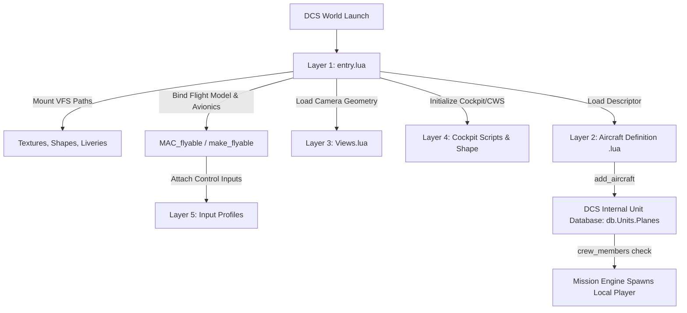
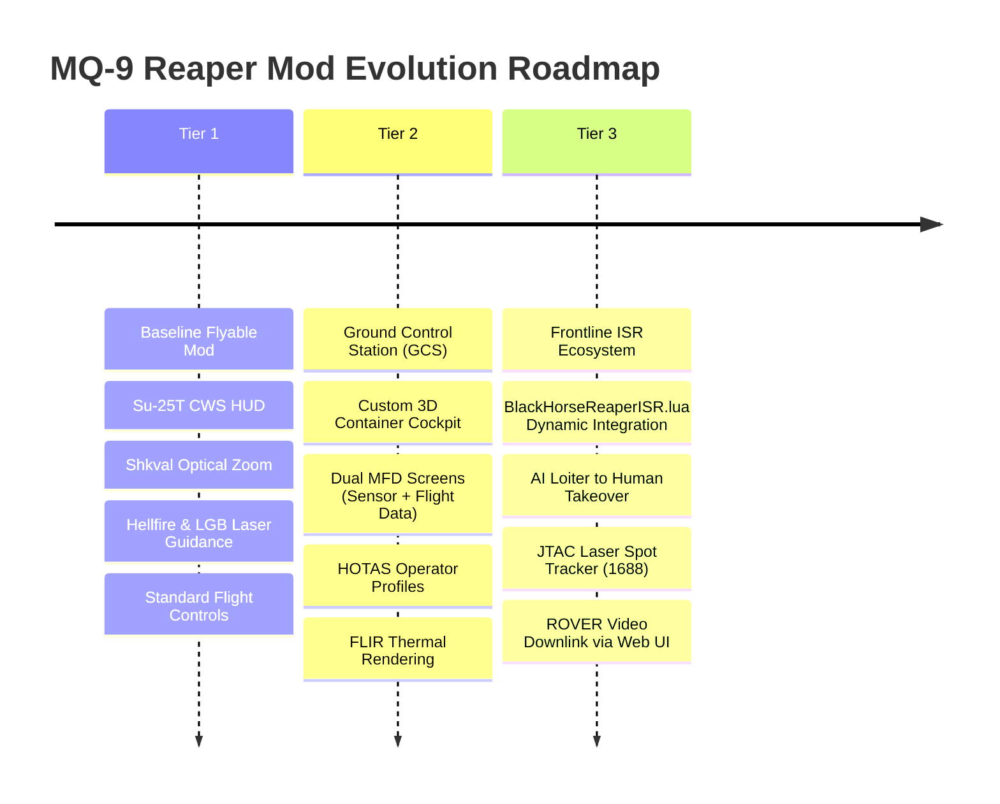

# DCS World Aircraft Modding: Architecture, Forensics, and MQ-9 Implementation Guide

---

## Executive Summary

This document provides a comprehensive technical breakdown of how flyable aircraft mods operate in modern DCS World (2.9+), forensic analysis of the bugs identified in legacy community mods, and the complete blueprint for converting the **MQ-9 Reaper** into a fully flyable, combat-ready UAV with targeting and weapons capabilities.

---

## 1. Modern DCS Aircraft Mod Architecture (The 5 Layers)

Every modern flyable aircraft mod in DCS World operates across five interdependent architectural layers:

```
Mods/aircraft/<Mod_Name>/
├── entry.lua                 # Layer 1: Plugin registration, VFS mounting, flyable binding
├── <Aircraft_Name>.lua       # Layer 2: Aircraft descriptor (SFM, weights, pylons, crew_members)
├── Views.lua                 # Layer 3: Camera geometry, cockpit eye points, 6-DOF limits
├── Cockpit/                  # Layer 4: Avionics, Cockpit Weapon System (CWS), 3D interior
│   ├── Scripts/device_init.lua
│   └── Shape/Cockpit_<Name>.EDM
└── Input/                    # Layer 5: Control profile mappings (keyboard, mouse, joystick)
    └── <Profile_Name>/
```



---

### Layer 1: `entry.lua` (Plugin Registration & VFS Mounts)

`entry.lua` is evaluated once during DCS application startup. It serves three functions:
1. **Plugin Declaration**: Identifies the module to the DCS GUI, mission editor, and module manager via `declare_plugin()`.
2. **Virtual File System (VFS) Mounts**: Exposes external 3D models, textures, liveries, and sound archives to the DCS rendering engine:
   - `mount_vfs_model_path(path)`
   - `mount_vfs_texture_path(path)`
   - `mount_vfs_texture_archives(path)`
   - `mount_vfs_liveries_path(path)`
3. **Avionics & Flight Model Binding**: Registers the aircraft as flyable by linking the 3D unit name to its cockpit script directory and flight model parameters via `MAC_flyable(...)` or `make_flyable(...)`.

### Layer 2: Aircraft Descriptor (`<Aircraft_Name>.lua`)

This file defines the physical and operational parameters of the aircraft and registers it in the DCS global database (`add_aircraft(AircraftTable)`):
* **Identity**: `Name`, `DisplayName`, `Shape` (the exterior `.edm` model), and `shape_table_data`.
* **Crew Definition (`crew_members`)**: The single most critical table for human playability. If `crew_members` is empty (`{}`), DCS classifies the vehicle as strictly unmanned/AI and **silently drops the player slot during mission spawn**, forcing spectator or map view.
* **Aerodynamics (`SFM_Data`)**: Lift/drag polars ($C_{y0}, M_{zalfa}, C_x$), engine thrust tables, fuel consumption, idle/max RPM, and ceiling limits.
* **Pylons & Weapons**: Hardpoint coordinates, authorized ordnance CLSIDs (e.g. AGM-114K Hellfire, GBU-12 Paveway II, external tanks), and pylon launch restrictions.

### Layer 3: View Geometry (`Views.lua`)

Controls the virtual cameras:
* `CockpitLocalPoint = {X, Y, Z}`: Where the player's eyes sit relative to the 3D model center:
  - $X$ = Forward (+) / Aft (-)
  - $Y$ = Up (+) / Down (-)
  - $Z$ = Right (+) / Left (-)
* `CameraViewAngleLimits`: Minimum and maximum Field of View (FOV) in degrees.
* `limits_6DOF`: Boundaries for TrackIR / VR head movement.
* `Chase` and `Arcade`: External follow camera offsets and pitch angles.

### Layer 4: Cockpit & Avionics (`Cockpit/`)

DCS aircraft cockpits are either:
1. **High-Fidelity (EFM + Custom Lua/C++ Avionics)**: Every gauge, MFD page, and switch is coded via Lua devices (`elements.lua`, `indicator.lua`).
2. **Low-Fidelity / CWS (Cockpit Weapon System)**: Uses DCS core avionics from Flaming Cliffs 3 or Su-25T. In `device_init.lua`:
   ```lua
   attributes = { "support_for_cws" }
   dofile(LockOn_Options.common_script_path .. "KNEEBOARD/declare_kneeboard_device_left.lua")
   ```
   DCS automatically binds the HUD, attitude indicator, weapon selection HUD, and the **Shkval TV optical targeting system** with laser designator.

### Layer 5: Input Profiles (`Input/`)

Located in `Input/<Plane_Name>/`:
* Subfolders: `keyboard`, `joystick`, `mouse`, `headtracker`, `trackir`.
* Each subfolder contains `default.lua`, defining commands, axes, and key combos.
* `name.lua` returns the localized string matching `InputProfiles` in `entry.lua`.

---

## 2. Forensic Analysis of Identified Bugs

During the teardown and testing of the legacy MQ-9 Reaper mod, five major failure modes were identified:

| Bug / Phenomenon | Root Cause | Consequence in Modern DCS | Solution |
| :--- | :--- | :--- | :--- |
| **1. Unexpected Symbol Near '?'** | PowerShell UTF-8 encoding wrote a 3-byte Byte Order Mark (`0xEF, 0xBB, 0xBF`) at line 1 of `.lua` files. | DCS Lua parser failed immediately on line 1; entire mod failed to register. | Enforce pure ASCII or Python UTF-8 without BOM across all Lua files. |
| **2. Silent Spawn Failure (AI spawns, Player does not)** | DCS CoreMods defines `MQ-9 Reaper` with `crew_members = {}`. | DCS mission engine refuses to place human players in aircraft without pilot seats; silently drops player slot. | Define `crew_members[1]` with `can_be_playable = true` and `role = "pilot"`. |
| **3. Access Violation Crash at Spawn** | Mod called `make_flyable(..., '/Cockpit/KneeboardLeft/', ...)` while that folder didn't exist on disk, and `device_init.lua` called missing scripts. | DCS C++ tried to execute non-existent scripts during cockpit init, causing a null pointer memory access violation (`0xC0000005`). | Provide valid `device_init.lua` and mount official `Bazar/Textures/AvionicsCommon` textures. |
| **4. "Freelook Camera" Floating View** | Camera `CockpitLocalPoint` was positioned at `{2.40, -0.35, 0.0}` at the exterior nose sensor, outside the 3D cockpit mesh. | Player spawned into the aircraft, but the camera was floating in open space without a cockpit around it, appearing as an unattached free camera. | Align `CockpitLocalPoint` to the official Su-25T cockpit eye point (`{3.406, 0.466, 0.0}`) directly behind the HUD and Shkval display. |
| **5. Missing Cockpit Textures / Pink Glass** | `mount_vfs_model_path` for `Mods/aircraft/Su-25T/Cockpit/Shape` was omitted in `entry.lua`. | DCS could not find the Su-25T cockpit EDM, droplet scales, and illumination files. | Explicitly mount official Su-25T cockpit shapes and textures in `entry.lua`. |

---

## 3. Comparative Architecture Analysis

To verify industry standards, we analyzed the gold-standard community mod **F-22A Raptor** (by Grinnelli Designs) installed on the system:

```mermaid
classDiagram
    class F22A_Mod {
        +entry.lua (Mounts F-22A and F-22A_Cockpit textures)
        +F-22A.lua (Declares F_22A table with crew_members and SFM)
        +add_aircraft(F_22A)
        +make_view_settings('F-22A', ...)
        +MAC_flyable('F-22A', Cockpit/Scripts/, FM, comm.lua)
    }
    class Legacy_MQ9_Mod {
        -entry.lua (Hacked F-15E/MiG-31 leftover files from 2014)
        -No Aircraft.lua (Relied on core AI definition)
        -crew_members = empty
        -make_flyable with non-existent KneeboardLeft path
    }
    class Modern_MQ9_Mod {
        +entry.lua (Clean plugin declaration, Su-25T VFS mounts)
        +MQ-9.lua (Custom descriptor with crew_members[1] defined)
        +add_aircraft(Reaper)
        +Views.lua (Eye point at {3.406, 0.466, 0.0})
        +MAC_flyable('MQ-9 Reaper', Cockpit/Scripts/, nil, comm.lua)
    }
    Legacy_MQ9_Mod ..|> Modern_MQ9_Mod : Refactored to Modern Standards
    F22A_Mod ..|> Modern_MQ9_Mod : Architecture Mirror
```

---

## 4. Modern MQ-9 Reaper Implementation Specification

### 4.1. File Layout
```
C:\Users\danym\Saved Games\DCS\Mods\aircraft\MQ-9 Reaper\
├── entry.lua
├── MQ-9.lua
├── Views.lua
├── comm.lua
├── Cockpit/
│   ├── Scripts/
│   │   ├── device_init.lua
│   │   └── kneeboard_init.lua
│   └── Shape/
│       ├── Cockpit_Su-25T.EDM
│       ├── cockpit_su-25t.edm.ilv
│       └── Cockpit_Su-25T.edm.lua
├── Input/
│   └── MQ-9 Reaper/
│       ├── name.lua
│       └── keyboard/default.lua
├── Shapes/
│   └── mq-9_reaper.edm
├── Textures/
│   └── Theme/
└── Liveries/
    └── MQ-9 Reaper/
```

### 4.2. `entry.lua` Blueprint
```lua
self_ID = "MQ-9 Reaper by Community"
declare_plugin(self_ID, {
    image         = "FC.bmp",
    installed     = true,
    dirName       = current_mod_path,
    developerName = _("General Atomics / Community"),
    fileMenuName  = _("MQ-9 Reaper"),
    displayName   = _("MQ-9 Reaper"),
    shortName     = _("MQ-9"),
    version       = "2.9.0",
    state         = "installed",
    info          = _("MQ-9 Reaper Unmanned Aerial Vehicle (Flyable Mod)."),
    Skins         = {{ name = _("MQ-9 Reaper"), dir = "Theme" }},
    Missions      = {{ name = _("MQ-9 Reaper"), dir = "Missions" }},
    LogBook       = {{ name = _("MQ-9 Reaper"), type = "MQ-9 Reaper" }},
    InputProfiles = { ["MQ-9 Reaper"] = current_mod_path .. '/Input/MQ-9 Reaper' }
})

-- Mount external and cockpit 3D models and textures
mount_vfs_model_path   (current_mod_path .. "/Shapes")
mount_vfs_model_path   ("Mods/aircraft/Su-25T/Cockpit/Shape")
mount_vfs_texture_path ("Mods/aircraft/Su-25T/Cockpit/Textures/SU-25T-CPT-TEXTURES")
mount_vfs_texture_archives("Bazar/Textures/AvionicsCommon")
mount_vfs_liveries_path(current_mod_path .. "/Liveries")

-- Load camera geometry and aircraft definition
dofile(current_mod_path .. "/Views.lua")
dofile(current_mod_path .. "/MQ-9.lua")
make_view_settings('MQ-9 Reaper', ViewSettings, SnapViews)

-- Bind Cockpit Weapon System (CWS) and Flight Model
MAC_flyable('MQ-9 Reaper', current_mod_path .. '/Cockpit/Scripts/', {nil, old = 54}, current_mod_path .. '/comm.lua')

plugin_done()
```

### 4.3. `MQ-9.lua` Descriptor (Crew & Pylons Excerpt)
```lua
-- Essential human crew definition to guarantee player spawning
Reaper.HumanCockpit = true
Reaper.crew_members = {
    [1] = {
        ejection_seat_name = 0,
        drop_canopy_name   = 0,
        pos                = { 3.406, 0.466, 0.0 },
        can_be_playable    = true,
        role               = "pilot",
        role_display_name  = _("Pilot / Sensor Operator"),
    },
}

-- Register with DCS Database
add_aircraft(Reaper)
```

---

## 5. Development Roadmap: Beyond Basic Flight

Once the baseline flyable mod is operational, the following progressive development tiers can be implemented:



### Tier 1: Combat-Ready UAV (Current Milestone)
* **Cockpit**: Functional HUD with flight parameters (airspeed, altitude, heading, waypoint cue).
* **Targeting**: Shkval TV camera (`O`), 23x optical zoom, target lock (`Enter`), laser rangefinder/designator (`RAlt + L`).
* **Weapons Delivery**: AGM-114K Hellfire laser lock-on-before-launch (LOBL) and GBU-12 laser terminal guidance.

### Tier 2: Ground Control Station (GCS) Immersion
* **3D Cockpit Mesh**: Replace the Su-25T jet cockpit with a 3D model of an authentic **USAF MQ-9 GCS shipping container console**.
* **Dual Display Layout**:
  - Left Monitor: Tactical Situation Display (TSD), moving map, fuel flow, engine RPM.
  - Right Monitor: MTS-B electro-optical/infrared (EO/IR) primary video feed with crosshairs and telemetry overlay.
* **Camera Placement**: Seated inside the air-conditioned container, looking at the screens, with TrackIR/VR support.

### Tier 3: Autonomous AI / Human Handover (`BlackHorseReaperISR.lua`)
* **Mission Integration**: Seamless integration with the user's `DCS-AI-Frontline` mission generator.
* **Dynamic Handover**: The Reaper flies autonomous patrol patterns controlled by mission scripting until a human player connects to take manual control for a precision strike.
* **ROVER Streaming**: Export real-time video and target coordinates to ground units or external tactical web dashboards.
