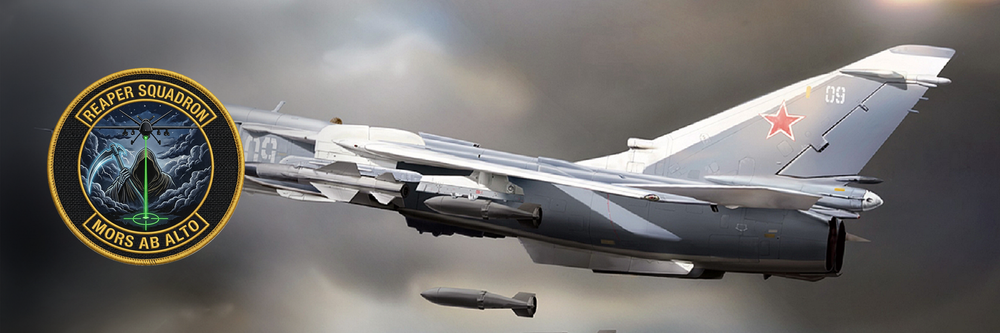
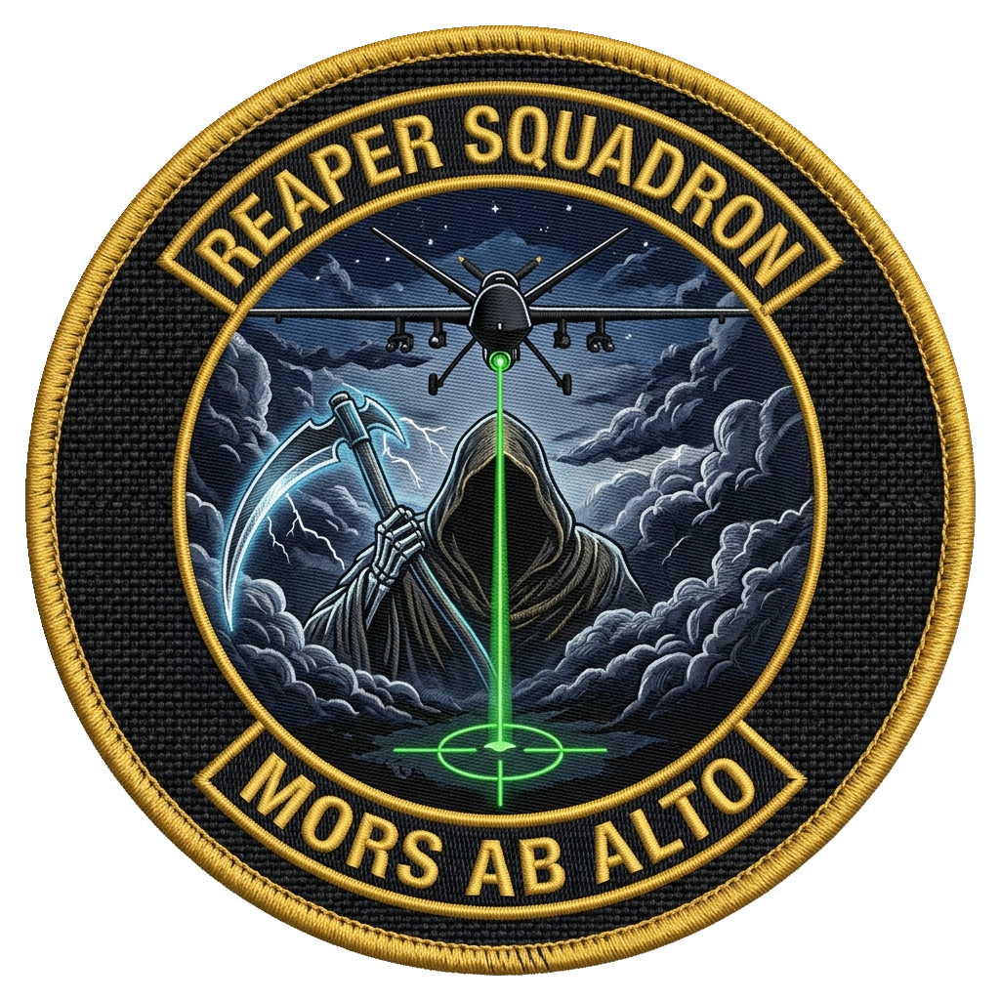
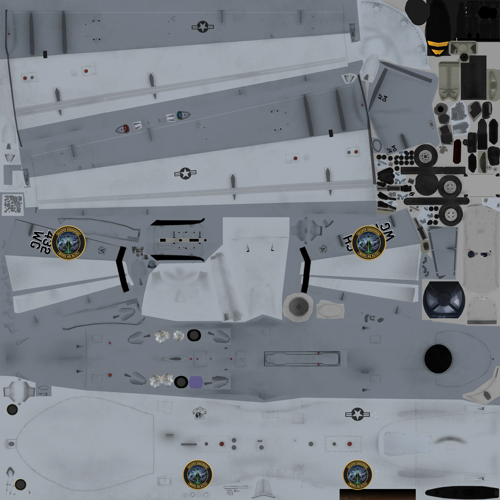
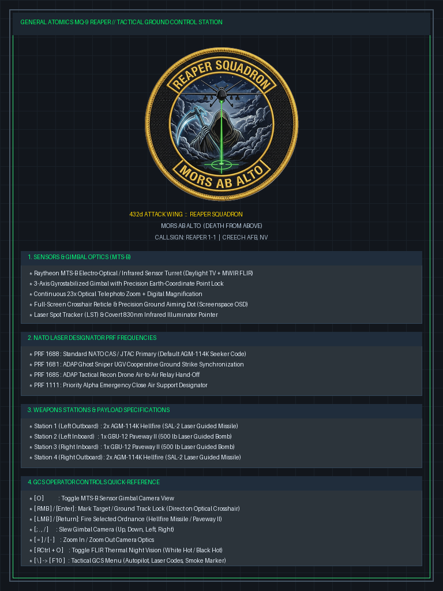

# MQ-9 Reaper UCAV — DCS World Standalone Module

<p align="center">
  
</p>

<p align="center">
  
  
  
  
  
</p>

---

## 🦅 Overview

The **General Atomics MQ-9 Reaper** (Predator B) is the quintessential armed, multi-mission, medium-altitude long-endurance (MALE) remotely piloted aircraft. This DCS World standalone module simulates the **Ground Control Station (GCS)** operator experience: an authentic tactical Head-Up Display, an electro-optical / infrared (EO/IR) sensor turret you slew by hand, hands-off autonomous orbit, and AGM-114 Hellfire / GBU-12 laser-guided strikes.

Built on a **Su-25T (FC3) flight-model shell** for rock-solid avionics and weapon integration, and developed under the **Autonomous Drone Asset Pack (ADAP)** initiative by **Yutani Industries** — *Building Better Worlds.*

> This is the operational proof-of-concept for the wider ADAP pack (RQ-28A recon UAV, ASD-1 ground robotics, and a Combined-Arms kill-web to follow). See [ROADMAP.md](ROADMAP.md).

---

## ✨ Key Features

- 🖥️ **Ground Control Station glass cockpit** — tactical primary flight display + payload camera interface.
- 🛰️ **Autonomous tangent-circle orbit** — 2,500 m circle holding ~2,420 m at ~160 kts, hands-off, no stall or altitude drop.
- 🎯 **EO/IR sensor turret (MTS-B)** — analog gimbal slew for azimuth/elevation, decoupled from aircraft bank.
- 🕹️ **Xbox / HOTAS mapping with GCS-correct throttle** — power lives on the bumpers and *holds* where you leave it, so releasing the sticks never drops the orbit (see [Controls](#-controls--gcs-operation)).
- 🚀 **Precision strike arsenal** — 4× AGM-114K Hellfire (SAL) + 2× GBU-12 Paveway II.
- 🔦 **Dynamic laser coding** — NATO PRF switching from the F10 GCS menu (1688 / 1685 / 1681 / 1111).
- 📺 **Multi-monitor & ultrawide presets** — full-screen CPG turret and ultrawide corner PiP.
- 📡 **Live combat HUD telemetry** — altitude, speed, weapon counts, laser code, and slant range.
- 🎨 **Squadron livery suite** — USAF 432d Wing / 432d Reapers / 17th ATKS / 11th RS, plus RAF, France, Italy.

---

## 📺 GCS View Presets

Copy the preset you want over your DCS `MonitorSetup`, or load it from the in-game monitor list.

| Preset file | Layout | Operational focus |
| :--- | :--- | :--- |
| [`Reaper_GCS_Fullscreen_CPG.lua`](Reaper_GCS_Fullscreen_CPG.lua) | Single monitor; toggle **`O`** / controller **`B`** | Whole screen becomes the live MTS-B targeting turret; toggle back to flight. |
| [`Reaper_GCS_Ultrawide_Corner_PIP.lua`](Reaper_GCS_Ultrawide_Corner_PIP.lua) | Full-width flight + lower-right sensor PiP | Full situational awareness with uninterrupted sensor overwatch. |

---

## 🎯 Autonomous Orbit & Combat Systems

- **Hands-off loiter** — engage orbit and the drone flies its own tangent circle while you work the sensor and weapons.
- **F10 GCS radio menu** — [`reaper_gcs_menu.lua`](reaper_gcs_menu.lua) drives laser coding, datalink, and the telemetry banner.
- **Laser code agility** (NATO PRF):

  | Code | Role |
  | :--- | :--- |
  | `1688` | Standard NATO designation |
  | `1685` | Drone-relay handoff |
  | `1681` | UGV / ground-unit sync |
  | `1111` | CAS priority |

---

## 🕹️ Controls & GCS Operation

The Xbox profile is tuned so the aircraft holds its orbit hands-off. The key design choice: **throttle is on the bumpers (RB/LB), not the triggers.** On an Xbox pad the LT/RT triggers share one axis that re-centers to ~50% when released — mapping throttle there would snap engine power to half and drop the drone out of its orbit. The bumpers ramp power and *hold* it where you let go, exactly like a GCS throttle quadrant.

| Action | Keyboard | Xbox Controller |
| :--- | :--- | :--- |
| Throttle up / down (holds) | `W` / `S` | **RB** / **LB** (press & hold to ramp) |
| Pickle / Fire | `Space` | `A` |
| Sensor turret / CPG view toggle | `O` | `B` |
| Target lock | `Enter` | `X` |
| Laser designator | `RShift + O` | `Y` |
| Sensor gimbal slew | `; . , /` | Right stick |
| Autopilot / Orbit hold | `H` | `Menu / Start` |

> The shipped Xbox `.diff.lua` also strips the Su-25T base binds that would otherwise double-fire on the pad (gun on the fire button, cannon on LB, and the slow view-slew on the D-pad).

---

## 🚀 Installation

The **repository root is the mod folder** — its contents go straight into your DCS aircraft mods directory.

### Option 1 — PowerShell (mirror sync)
```powershell
# Run from the repository root:
robocopy "." "$HOME\Saved Games\DCS\Mods\aircraft\MQ-9 Reaper" /MIR /FFT /Z /W:5 /R:2 /XD .git assets
```
*(DCS OpenBeta: target `$HOME\Saved Games\DCS.openbeta\Mods\aircraft\MQ-9 Reaper`.)*

### Option 2 — Manual
1. Copy the repository contents (`entry.lua`, `Cockpit/`, `Input/`, `Liveries/`, …).
2. Paste them into:
   ```text
   C:\Users\<You>\Saved Games\DCS\Mods\aircraft\MQ-9 Reaper\
   ```
3. Restart DCS World and pick the MQ-9 Reaper in the Mission Editor.

> Repo-only folders (`assets/`, `.git/`) are documentation and are excluded above — they are not part of the flyable mod.

---

## 🎨 Squadron Liveries & Insignia

<p align="center">
  
  &nbsp;&nbsp;&nbsp;
  
  &nbsp;&nbsp;&nbsp;
  
</p>

Selectable paint schemes from the Mission Editor and payload menus:

1. **432d Wing "Hunters" (Creech AFB)** — wing flagship command scheme.
2. **432d Reapers Strike Squadron** *(Mors Ab Alto)* — combat strike scheme with painted Reaper insignia.
3. **17th Attack Squadron (Creech AFB)** — hunter-killer operational squadron.
4. **11th Reconnaissance Squadron (Creech AFB)** — tactical ISR.
5. **Coalition allies** — RAF (UK), French Air & Space Force, Italian Air Force.

---

## 🗂️ Repository Layout

| Path | Contents |
| :--- | :--- |
| `entry.lua`, `MQ-9.lua` | Mod entry point and flyable definition (Su-25T shell). |
| `Cockpit/` | GCS scripts, HUD pages, and cockpit shape. |
| `Input/` | Keyboard + Xbox controller profiles (the throttle fix lives here). |
| `Liveries/` | Squadron paint schemes. |
| `Reaper_GCS_*.lua` | Monitor / viewport presets. |
| `reaper_gcs_menu.lua` | F10 GCS radio menu and telemetry banner. |
| `Documents/`, `ROADMAP.md`, `MOD_ARCHITECTURE_AND_PIPELINE.md` | Design docs and build pipeline. |
| `assets/` | GitHub banner and squadron insignia (repo docs only). |

---

## 🛠️ Credits & Notes

- **Development:** Yutani Industries — Autonomous Drone Asset Pack.
- **Flight model:** built on the Eagle Dynamics **Su-25T (FC3)** shell for stable avionics and weapon integration.
- **Assets:** this module reuses base-game Su-25T cockpit/shape assets from DCS World. Those Eagle Dynamics assets are **not for redistribution** outside a licensed DCS install — treat this repository as a working project, not a redistribution package.

---

<p align="center"><sub>Mors Ab Alto — Death From Above.</sub></p>
