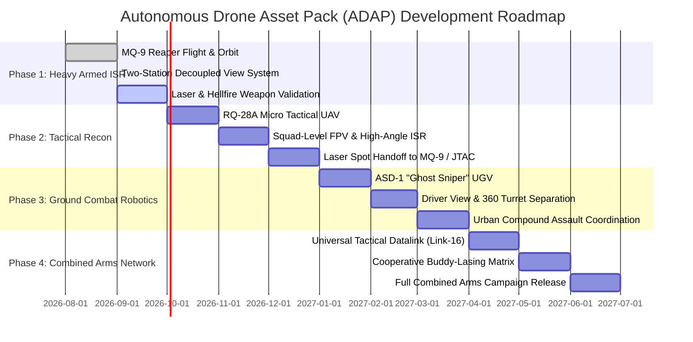

# Autonomous Drone Asset Pack (ADAP) :: Strategic Roadmap
## The Combined Arms Drone Warfare Revolution in DCS World

---

## 1. The Strategic Manifesto: Reclaiming Combined Arms

Modern combat simulations in DCS World have long suffered from the **"Maverick Syndrome"**—a hyper-focus on fast-jet pilots dogfighting at Mach 1.2 or tossing munitions from 35,000 feet onto pre-planned coordinates.

**Air dominance alone does not hold ground. Wars are won in the dirt through Combined Arms.**
* Real-world conflicts (Ukraine, the Middle East, the Red Sea, and modern standoff doctrines) prove that territory is captured, cleared, and secured only when ground forces, armor, JTACs, and unmanned systems operate as a synchronized kill web.
* Fast jets cannot loiter for 14 hours over an urban compound tracking sniper nests or infantry movements through tree cover.
* Ground commanders and Combined Arms players need **persistent autonomous aerial overwatch, live video feeds, real-time laser target designation, and precision standoff strikes** to enable ground units to advance and capture objectives.

The **Autonomous Drone Asset Pack (ADAP)** bridges this gap, establishing a new operational standard for unmanned multi-domain warfare in DCS World.

---

## 2. The Proven Architectural Standard: Decoupled Two-Station Workflow

Every platform in the Autonomous Drone Pack is engineered around a **Decoupled Two-Station Architecture**, separating aircraft flight management from weapons/sensor employment:

```
               +======================================================+
               |        ADAP UNMANNED COMBAT SYSTEM ARCHITECTURE      |
               +======================================================+
                                          |
                +-------------------------+-------------------------+
                |                                                   |
                v                                                   v
   [ STATION 1: PILOT / DRIVER CAM ]          [ STATION 2: SENSOR / WEAPONS TURRET ]
   ---------------------------------          --------------------------------------
   * Forward Flight Navigation                * 3-Axis Gyro-Stabilized Ground Gimbal
   * Altitude, Airspeed & Horizon Control     * Azimuth & Elevation Decoupled from Bank
   * Waypoint Navigation & Autonomous Orbit   * 1x - 23x High-Definition Optical Zoom
   * Obstacle Avoidance & In-Transit Pilot    * Dual-Band Mid-Wave FLIR & Daylight TV
   * Hands-Off Loiter: Drone flies itself     * Digital Laser Rangefinder (Slant Range)
                                              * NATO PRF Target Designator (Codes 1111-1688)
                                              * Precision Ordnance (AGM-114K Hellfire / LGB)
```

---

## 3. Operational Implementations (Validated on MQ-9 Reaper)

The MQ-9 Reaper serves as the operational proof of concept for the entire pack, implementing four distinct deployment modes for single, ultrawide, and multi-monitor setups:

| Deployment Mode | Monitor Preset | Configuration | Operational Focus |
| :--- | :--- | :--- | :--- |
| **Full-Screen CPG Combat** *(AH-64D Style)* | `Reaper_GCS_Fullscreen_CPG.lua` | Single 5120x1440 monitor; toggled via **`[ O ]`** / Controller **`[ B ]`** | Pushing `O` transforms the entire screen into the live MTS-B targeting turret; pushing again returns to flight. |
| **Side-by-Side GCS Console** | `Reaper_GCS_Ultrawide_PIP.lua` | Left 3840px (16:9 Flight) + Right 1280px (Full-Height Sensor) | Simultaneous dual-station operation; pilot and gunner consoles side by side. |
| **Corner PiP Overlay** | `Reaper_GCS_Ultrawide_Corner_PIP.lua` | Full 5120x1440 Flight + 1440x1080 lower-right PiP window | Full-screen flight situational awareness with uninterrupted sensor overwatch. |
| **Dual-Monitor JTAC Station** | `Pilot_Plus_ReaperCam.lua` | Screen 1 (5120x1440 Flight) + Screen 2 (1920x1080 Full Sensor) | Hardware-separated command station; dedicated physical display for sensor feed. |

### Integrated Tactical Features:
* **Autonomous Orbit Flight Model**: 2,500m tangent circle holding 2,420m altitude and 160 kts hands-off loiter without stall or altitude drop.
* **Live Combat HUD Overlay (F10 Menu F3-9)**: Real-time telemetry banner streaming flight altitude, speed, weapon counts, NATO laser code, and target range.
* **Laser Code Agility**: Dynamic PRF switching (1688 standard NATO, 1681 UGV sync, 1685 drone relay, 1111 CAS priority).
* **Multi-Format Weaponry**: 4× AGM-114K Hellfire missiles (SAL-2) + 2× GBU-12 Paveway II laser-guided bombs.

---

## 4. Multi-Phase Pack Expansion Roadmap



### Phase 1: Heavy Armed ISR Overwatch (MQ-9 Reaper) — *Current Benchmark*
- [x] Autonomous tangent-circle orbit stabilization (hands-off loiter).
- [x] Su-25T CWS avionics & AGM-114K Hellfire weapon integration.
- [x] Decoupled Pilot and Sensor Operator camera viewpoints.
- [x] Multi-monitor and ultrawide PiP / CPG viewport presets.
- [x] F10 GCS tactical radio menu with laser coding and datalink controls.
- [x] Real-time Combat HUD telemetry overlay.
- [ ] Precision target destruction verification under live combat conditions.

### Phase 2: Tactical Squad Recon Drone (RQ-28A)
- [ ] Hand-launched micro-UAV designed for forward platoon reconnaissance.
- [ ] Station 1: FPV pilot maneuver camera (low-latency forward view).
- [ ] Station 2: High-angle optical/thermal ISR sensor turret.
- [ ] Buddy-Lasing Relay: Illuminates ground targets on PRF Code 1685 for overhead MQ-9 Reaper Hellfire strikes.
- [ ] Low acoustic signature and small radar cross-section for contested airspace penetration.

### Phase 3: Unmanned Ground Combat Vehicles (ASD-1 "Ghost Sniper" UGV)
- [ ] Tracked/wheeled autonomous ground combat vehicle for urban assault and perimeter security.
- [ ] Station 1: Driver low-profile driving camera with terrain navigation aids.
- [ ] Station 2: Independent 360° stabilized remote weapon station (RWS) with precision anti-material rifle / ATGM.
- [ ] Synchronized laser code handoff (PRF 1681) to communicate directly with overhead air assets.
- [ ] Building clearing, ambush suppression, and compound capture capabilities for Combined Arms ground commanders.

### Phase 4: The Integrated Combined Arms Tactical Network
- [ ] **Cooperative Multi-Domain Kill Web**: Ground troop marks target with laser pointer $\rightarrow$ UGV confirms coordinates $\rightarrow$ MQ-9 Reaper conducts standoff Hellfire strike $\rightarrow$ Ground troops advance and capture zone.
- [ ] **ROVER Video Downlink Protocol**: Direct video streaming to JTAC tablets and mobile command centers.
- [ ] **Dynamic Objective Capture Logic**: Automated mission triggers that detect hostile clearance and formally award zone capture to ground forces.
- [ ] **Dedicated Combined Arms Campaign**: Fully voiced, multi-mission campaign showcasing joint drone/ground warfare operations.

---

## 5. Technical Conventions & Standardization

To ensure zero conflicts and rapid modding across the pack, all future ADAP vehicles adhere to the following standards:

1. **VFS Structure**: Pure relative paths with forward slashes (`/`) for cross-platform engine safety.
2. **SFM Envelope**: Validated lift slopes ($M_{zalfa} \approx 6.6$), positive zero-alpha lift ($C_{y0} \approx 0.3$), and non-zero minimum throttle ($MinRUD = 0$) to eliminate unrecoverable stalls.
3. **Controller Architecture**: Unified HOTAS mapping across all assets:
   * **Pickle / Fire**: `[ A ]` or `[ Space ]`
   * **Sensor Optics**: `[ B ]` or `[ O ]`
   * **Target Lock**: `[ X ]` or `[ Enter ]`
   * **Laser Designator**: `[ Y ]` or `[ RShift + O ]`
   * **Gimbal Slew**: Directional D-Pad or `; . , /`
   * **Autopilot / Orbit**: `[ Menu / Start ]` or `[ H ]`
4. **Clean Deployment Pipeline**: Single-command build and validation via `repack_and_deploy.ps1` with automated syntax checks.

---

## 6. North Star — The Deployable Ground Control Station (Paid Flagship)

The flagship feature of the paid release, modeled on the **real MQ-9 GCS**: a deployable shelter/container **"Reaper HQ"** placed on the battlefield, crewed by two.

**The concept (authentic to the real system):**
* A **placeable GCS container** at an airfield, FARP, FOB, or command center.
* A **Combined Arms** player drives up, parks, and **enters Reaper HQ**.
* Inside: a **two-seat Ground Control Station** — a **Rated Pilot** (flies the aircraft, releases weapons) and a **Sensor Operator (SO)** (runs the MTS-B EO/IR ball, laser designator, and target track). *(Real USAF billet is Pilot + Sensor Operator, not "Weapons Officer.")*

**Feasibility — build order by capability tier:**
| Capability | Path | Tier |
| :--- | :--- | :--- |
| GCS container as a map object (EDM static/tech mod) | Buildable now | Free |
| "Drive up + enter HQ" | No native walk-in; simulate via MP proximity trigger → F10 action → slot handoff into the Reaper | Free |
| Single-player two-station (pilot cam ↔ sensor cam) | Already implemented | Free |
| **True 2-seat multicrew** (Pilot + SO, two networked humans, one Reaper) | **Full-fidelity module only — requires ED's professional SDK** | **Paid** |
| Real FLIR/thermal sensor device + custom GCS cockpit | Same — ED SDK / full module | **Paid** |

**Strategic role:** the free shell version (container + scripted entry + single-player decoupled GCS) is the **proof that earns the paid version**. The 2-crew container GCS is the single most compelling reason to pursue an ED third-party partnership — it fills a category DCS does not have (unmanned two-crew GCS) and is authentic to the real platform. **Discipline: the flyable Reaper POC must be finished and validated (kills confirmed) before this is built.**
